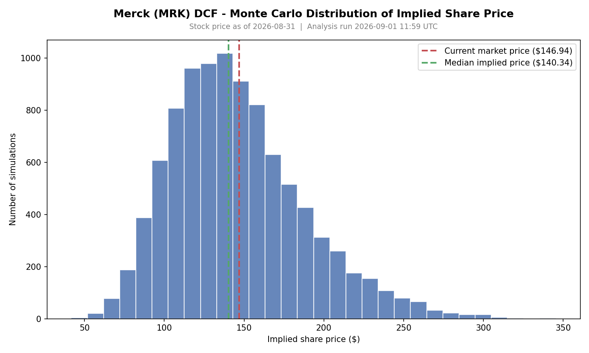

# Merck (MRK) DCF Valuation with Monte Carlo Uncertainty

A discounted cash flow (DCF) valuation of Merck & Co., extended with a 10,000-iteration Monte Carlo simulation so the result is a *distribution* of implied share prices instead of a single number.

Built as a self-directed project to learn valuation modelling from fundamentals. It is a learning and portfolio project, **not investment advice**.



## Results (stock price as of 2026-08-31, $146.94)

| | Implied share price |
|---|---|
| Single-point DCF | $141.59 (-3.6% vs. market) |
| Monte Carlo median | $140.34 |
| Monte Carlo mean | $146.01 |
| 5th to 95th percentile | $88 to $226 |

The point of the simulation is the width of that range. With these assumptions the model cannot distinguish "fairly valued" from "meaningfully over- or undervalued": in 56.8% of simulations the implied price came in below the market price, which is close to a coin flip. The single-point figure looks precise only because it hides the uncertainty in the inputs.

## How it works

1. **WACC** (`model/wacc.py`): CAPM cost of equity blended with after-tax cost of debt, weighted at market value. Result: 5.99%.
2. **DCF** (`model/dcf_model.py`): projects revenue for 2026-2030 from explicit growth assumptions (including a modelled revenue decline in 2029 for the Keytruda patent expiry), applies the historical average free-cash-flow margin, discounts at WACC, and adds a Gordon Growth terminal value.
3. **Monte Carlo** (`model/monte_carlo.py`): samples the genuinely uncertain inputs from normal distributions and reruns the DCF each time:
   - **Beta** (0.30 +/- 0.15): free data sources disagreed materially (one reported 0.23, another -0.23), so this is the input with real source uncertainty.
   - **2029 growth** (-3% +/- 4%): the patent-cliff year. Merck's 10-K says US sales will decline "materially" without quantifying it, so it gets a much wider spread than other years.
   - **Other growth years** (+/- 1%), **terminal growth** (2.5% +/- 0.5%), **FCF margin** (historical average +/- 3%; the 2021-2025 range was 15.2% to 28.2%).
   - Fixed random seed (42), so results are reproducible.

## Things that went wrong, and what I did about them

- **Numerical instability in the terminal value.** One early simulation draw produced an implied share price of about $4,030. When WACC is only slightly above the terminal growth rate, the Gordon Growth denominator becomes tiny and the formula explodes. The model now requires a minimum 2-percentage-point spread between WACC and terminal growth and raises an error otherwise. Simulation draws that violate it are discarded and counted: 400 of 10,000 (4.0%) in the current run.
- **Silent duplication of assumptions.** An earlier Monte Carlo script re-typed the base-case growth and terminal-growth values instead of importing them from the DCF, so changing one would have silently left the other stale. It now imports them.
- **A structural break in the historical data.** Revenue jumps 68% between 2009 and 2010. That is the Schering-Plough merger, not organic growth. Growth and margin assumptions therefore use only 2021-2025, and the longer SEC history is kept for context only.
- **Gaps are left as gaps.** The SEC pull is missing revenue for 2011-2015 and operating cash flow for 2021, probably because Merck used a different XBRL tag in those years. They are stored as missing, not interpolated.

## Limitations

- **Terminal value dominates.** About 84% of enterprise value comes from the terminal value, so the result is very sensitive to WACC and terminal growth.
- **WACC is low (5.99%)** because Merck's reported beta is unusually low (0.30). Typical pharma DCFs use roughly 7-9%. The beta uncertainty in the simulation partly addresses this, but it is a real weakness of the base case.
- **Simple structure.** Free cash flow is revenue times a margin. There is no segment build, no pipeline, no explicit capex or working-capital schedule.
- **Independent inputs.** Each input is sampled independently, though in reality they are correlated (for example, weak growth and weak margins tend to come together).
- **Hand-assembled inputs.** Some inputs (share price, shares outstanding, debt, cash) were transcribed from public sources, with sources noted in `data/merck_historicals.py`. The share price is approximate and dated 2026-08-31; refresh it before reusing.

## Running it

```bash
pip install -r requirements.txt

python model/wacc.py                      # WACC breakdown
python model/dcf_model.py                 # single-point DCF
python model/monte_carlo.py               # Monte Carlo summary
python model/monte_carlo.py --plot        # also saves output/monte_carlo_distribution.png
python model/monte_carlo.py --n-simulations 50000
```

Run from the project root. The `data/fetch_*.py` scripts refresh the underlying data from SEC EDGAR (`fetch_merck_data_sec_edgar.py`, which requires you to set your own name and email in `USER_AGENT`, as the SEC requires) and Yahoo Finance (`fetch_merck_data_yfinance.py`). They print values for you to review; they do not overwrite `merck_historicals.py`.

## Project layout

```
data/
  merck_historicals.py            historical financials and market inputs, with source notes
model/
  wacc.py                         WACC calculation
  dcf_model.py                    parameterised DCF
  monte_carlo.py                  Monte Carlo simulation and plot
output/
  monte_carlo_distribution.png
```

## Possible next steps

Sensitivity tables for WACC against terminal growth, correlated inputs, a quarterly version, and the same model applied to a second company.
